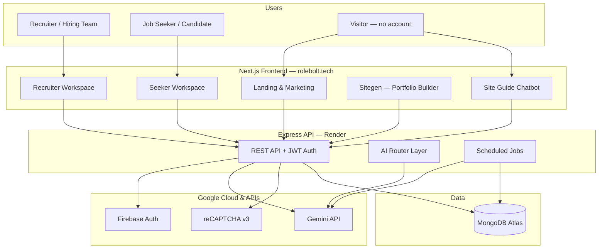
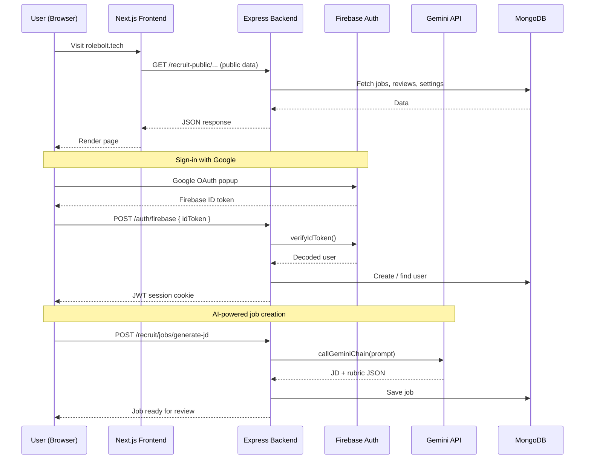
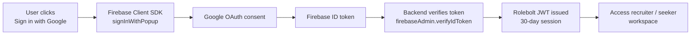
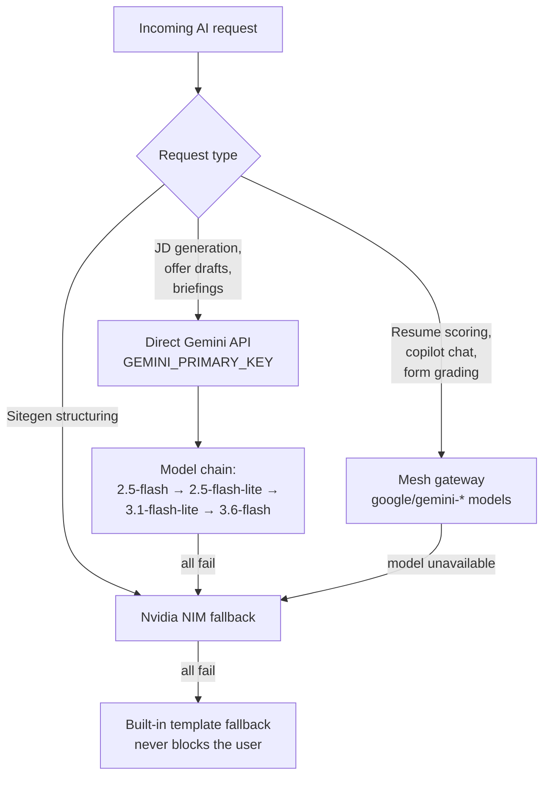
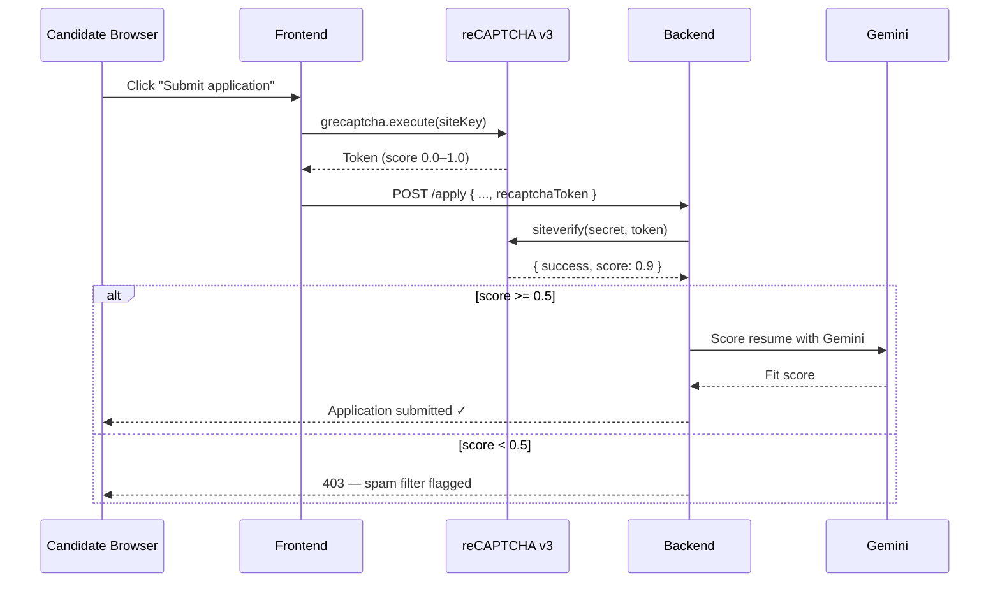
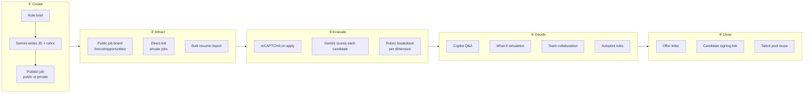

# Rolebolt — Judge's Technical Brief

**Build with Gemini XPRIZE · Professional Services / Small Business Services**

| | |
|---|---|
| **Live product** | [rolebolt.tech](https://www.rolebolt.tech) |
| **Interactive testing kit** | [rolebolt.tech/recruit/judges](https://www.rolebolt.tech/recruit/judges) |
| **Category** | AI-native hiring platform for small teams & job seekers |
| **Built** | July 2026 — actively deployed in production |
| **Repository** | `backend/` (Express API) + `frontend/` (Next.js) |

---

## 1. One-minute summary

**Rolebolt is an AI-native recruiting workspace** where hiring teams publish jobs, score candidates with Gemini-powered rubrics, automate pipeline work, and collaborate — while job seekers browse opportunities, see fit scores, and manage their search in one place.

Unlike a demo chatbot bolted onto a form builder, **Gemini is embedded in the core hiring loop**: job creation, resume scoring, assessments, copilot Q&A, daily briefings, and portfolio generation. Google Cloud services handle identity (Firebase), bot protection (reCAPTCHA v3), and the intelligence layer (Gemini API).

---

## 2. Vision

> *Hiring software should help people make better decisions, not just move faster.*

Recruiting today is fragmented: job descriptions in one doc, resumes in email, notes in Slack, decisions in spreadsheets. Rolebolt keeps **signal next to action** — every candidate, score, assessment answer, and team note lives in one workspace.

**Long-term vision:** become the default operating system for small-business hiring in markets where LinkedIn and enterprise ATS tools are too expensive or too heavy — powered by Gemini so a 3-person startup can hire like a 30-person TA team.

---

## 3. Google Cloud & Google services used

Rolebolt runs on a deliberate **Google-first stack** for identity, intelligence, and abuse prevention.

| Google service | Role in Rolebolt | Where in code |
|---|---|---|
| **Google Gemini API** | Primary AI engine — JD generation, resume scoring, rubrics, copilot, briefings, seeker tools | `backend/src/ai/geminiClient.ts` → `generativelanguage.googleapis.com` |
| **Gemini models (via Mesh gateway)** | High-volume scoring, streaming copilot, form evaluation, site guide chat | `backend/src/ai/meshClient.ts` — models like `google/gemini-2.5-flash-lite` |
| **Firebase Authentication** | Google OAuth sign-in, phone OTP for seekers/recruiters | `frontend/src/lib/firebaseClient.ts`, `backend/src/firebaseAdmin.ts` |
| **Firebase Admin SDK** | Server-side verification of Firebase ID tokens (SSO) | `backend/src/firebaseAdmin.ts` |
| **reCAPTCHA v3** | Invisible bot detection on public job applications & form submissions | `backend/src/publicSubmissionGuard.ts` |
| **Google Cloud project** | Firebase project hosts Auth; Gemini API keys billed under GCP | Configured via `FIREBASE_SERVICE_ACCOUNT_JSON` + `GEMINI_PRIMARY_KEY` env vars |

### GCP project configuration

- **Firebase project** — configured through environment variables (`NEXT_PUBLIC_FIREBASE_*` on frontend, `FIREBASE_SERVICE_ACCOUNT_JSON` on backend). Used for Google Sign-In and phone authentication.
- **Gemini API** — direct REST calls to Google's Generative Language API (`GEMINI_PRIMARY_KEY`). Model chain: `gemini-2.5-flash` → `gemini-2.5-flash-lite` → `gemini-3.1-flash-lite` → `gemini-3.5-flash-lite` → `gemini-3.6-flash`.
- **reCAPTCHA v3** — site key on frontend (`NEXT_PUBLIC_RECAPTCHA_SITE_KEY`), secret verified server-side (`RECAPTCHA_SECRET_KEY`).

> Evidence screenshots (GCP billing, Gemini usage dashboard) belong in [`Product_Evidence/`](Product_Evidence/README.md).

---

## 4. System architecture

### High-level platform diagram



### Request flow — how a typical session works



---

## 5. How each Google service works in Rolebolt

### 5.1 Firebase Authentication

**Purpose:** Frictionless sign-in for recruiters and job seekers without building OAuth from scratch.



**Also supports:** Phone number OTP via Firebase `RecaptchaVerifier` + `signInWithPhoneNumber` on seeker signup/login pages.

**Why it matters for judges:** Real users sign in with Google in production. Firebase handles token refresh, provider trust, and phone verification — Rolebolt focuses on hiring logic.

---

### 5.2 Google Gemini API

**Purpose:** The product's intelligence layer. Gemini is not a sidebar feature — it runs inside every high-value hiring action.

#### Gemini model routing strategy



#### Where Gemini is used (production features)

| Feature | What Gemini does | User sees |
|---|---|---|
| **Job description generator** | Writes full JD + weighted scoring rubric from a role brief | "Review & Generate" step when creating a job |
| **Resume scoring** | Scores each candidate against the job rubric (0–100 + breakdown) | Fit score on candidate cards & job apply page |
| **Recruiting Copilot** | Streaming Q&A grounded in jobs, candidates, pipeline data | "Ask Rolebolt" drawer on job pages |
| **Form job scoring** | Evaluates structured application answers | Applicant timeline with AI grades |
| **What-If simulator** | Models pipeline changes before you commit | Simulation tab on job workspace |
| **Daily hiring briefing** | Cron-generated email summary of pipeline health | Morning email to active recruiters |
| **Seeker tools** | Resume improvement, cover letters, interview prep | `/seeker/resume`, `/seeker/cover-letter` |
| **Site guide chatbot** | Public product guide on the landing page | Floating "Ask Rolebolt" widget |
| **Sitegen** | Structures resume text into portfolio website sections | `/website` — publish at `rolebolt.tech/{username}` |
| **Collaboration AI** | Summarises candidate discussion threads | Collaboration tab notes |

**API endpoint used:** `https://generativelanguage.googleapis.com/v1beta/models/{model}:generateContent`

**Reliability pattern:** Every critical path has a **multi-model chain** (try 5 Gemini models) → Mesh fallback → Nvidia NIM → hardcoded template. Users never see a blank screen because one model is down.

---

### 5.3 reCAPTCHA v3 (bot detection)

**Purpose:** Public endpoints (job applications, form submissions) trigger **paid Gemini scoring**. Without bot protection, a script could burn API credits and pollute pipelines.



**Additional protection:** Per-IP rate limiting (8 submissions / 10 minutes) in `publicSubmissionGuard.ts`.

**Why judges should care:** This is a **production-grade abuse model** — AI cost is tied to verified human traffic, not open endpoints.

---

## 6. End-to-end hiring workflow (judge walkthrough)



### Recommended 10-minute judge test

1. Open **[rolebolt.tech/recruit/judges](https://www.rolebolt.tech/recruit/judges)** — copy-paste sample job + resumes provided.
2. Create a Standard Job → watch Gemini generate the JD and rubric.
3. Import the high-score resume → see AI fit score (~85+).
4. Import the low-score resume → see the contrast (~30–40).
5. Open **Copilot** → ask *"Who should I interview first and why?"*
6. Browse **Find Jobs** as a seeker → see match score on a public role.
7. Try the **Site Guide** chatbot on the homepage — powered by Gemini streaming.

---

## 7. AI-native business operations

Rolebolt is not only "AI inside the product" — **the business itself runs on AI-assisted workflows:**

| Operation | How AI helps |
|---|---|
| **Recruiter daily briefing** | Automated cron emails summarising pipeline health (Gemini) |
| **Candidate communication** | Stage email templates + AI-drafted outreach for premium creators |
| **Content & SEO** | Structured job pages, FAQ schema, resource articles |
| **Support** | Site guide chatbot answers product questions 24/7 without a support team |
| **Quality control** | Rubric-based scoring replaces gut-feel first-pass screening |

---

## 8. What makes Rolebolt different

| Typical hackathon project | Rolebolt |
|---|---|
| Chatbot wrapper | Full ATS + seeker workspace in production |
| Single Gemini call | 15+ distinct AI features with fallback chains |
| Local demo only | Live at rolebolt.tech with real auth & billing |
| No abuse model | reCAPTCHA v3 + rate limits on AI-triggering endpoints |
| Auth stub | Firebase Google SSO + phone OTP in production |

---

## 9. Roadmap — what comes next

### Near term (Q3–Q4 2026)

- **Gemini Live / multimodal interviews** — voice-based async screening with transcript scoring
- **AI agent for scheduling** — calendar-aware interview coordination
- **Deeper GCP integration** — Cloud Run migration, Cloud Logging for AI audit trails
- **Gemini embeddings** — semantic talent pool search across past candidates
- **WhatsApp job alerts** — reach candidates where they already are (India-first)

### Medium term (2027)

- **Multi-language JD generation** — Hindi, Tamil, Telugu for regional hiring
- **Employer analytics copilot** — natural-language queries over hiring data ("Why is my engineering funnel slow?")
- **Marketplace for verified creators** — connect form-job employers with assessment designers
- **Chrome extension GA** — one-click "Save to Rolebolt" from any job board (seeker tracker)

### Long term

- **AI-native staffing agency mode** — Rolebolt operates placements, not just software
- **API for HRIS integrations** — Gemini-powered sync with payroll & onboarding tools

---

## 10. Technical reference (for deep reviewers)

| Item | Detail |
|---|---|
| **Frontend** | Next.js 16, React 19, Tailwind CSS 4, TypeScript |
| **Backend** | Express 5, Mongoose, tsx runtime, Node 20 |
| **Database** | MongoDB Atlas |
| **Deployment** | Render (see `render.yaml`) — separate frontend & backend services |
| **Payments** | Razorpay subscriptions (Free / Pro / Ultra tiers) |
| **Email** | Resend (verification, briefings, notifications) |
| **Health checks** | `GET /health`, `GET /ai-routing` (reports Gemini/Mesh/Nvidia status) |

### Key environment variables

```
# Google Gemini (direct)
GEMINI_PRIMARY_KEY=...

# Google Gemini (via Mesh — scoring, copilot, forms)
GEMINI_MESH_KEY=...

# Firebase (server)
FIREBASE_SERVICE_ACCOUNT_JSON={...}

# Firebase (client)
NEXT_PUBLIC_FIREBASE_API_KEY=...
NEXT_PUBLIC_FIREBASE_AUTH_DOMAIN=...
NEXT_PUBLIC_FIREBASE_PROJECT_ID=...

# reCAPTCHA
NEXT_PUBLIC_RECAPTCHA_SITE_KEY=...   # frontend
RECAPTCHA_SECRET_KEY=...             # backend
```

---

## 11. Evidence checklist for scoring

Before final submission, confirm these artifacts exist in [`Product_Evidence/`](Product_Evidence/):

- [ ] GCP billing summary showing active project usage
- [ ] Gemini API usage screenshot (Google AI Studio or Cloud Console)
- [ ] Firebase console screenshot (Auth providers enabled)
- [ ] reCAPTCHA admin console screenshot (v3 site registered)
- [ ] Revenue proof (Razorpay dashboard or redacted invoices)
- [ ] Agent operations log (how AI runs the business day-to-day)

---

## 12. Contact & links

| Resource | URL |
|---|---|
| **Product** | https://www.rolebolt.tech |
| **Judges testing kit** | https://www.rolebolt.tech/recruit/judges |
| **Public job board** | https://www.rolebolt.tech/recruit/opportunities |
| **Sitegen (portfolio builder)** | https://www.rolebolt.tech/website |
| **Pricing** | https://www.rolebolt.tech/recruit/pricing |
| **Support** | support@rolebolt.tech |

---

*Built for the Build with Gemini XPRIZE. Rolebolt — clearer hiring for everyone.*
